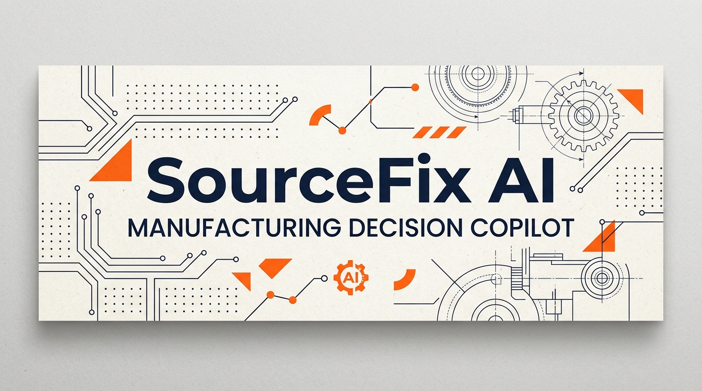
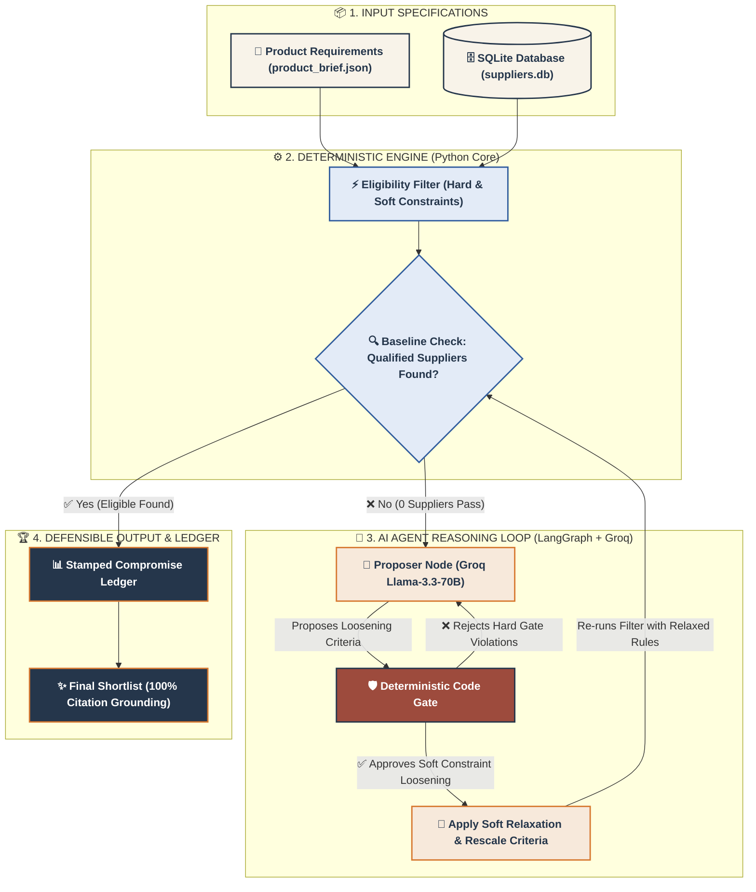

<p align="center">
  
</p>

<h1 align="center">SourceFix | AI Manufacturing Decision Copilot</h1>

<p align="center">
  <strong>Turn complex procurement briefs into defensible, citable supplier shortlists with zero hallucinated trade-offs.</strong>
</p>

<p align="center">
  <a href="#-architecture-overview"></a>
  <a href="#-running-tests--verification"></a>
  <a href="#-quickstart-guide"></a>
  <a href="https://source-fix.vercel.app/"></a>
</p>

<p align="center">
  🚀 <strong><a href="https://source-fix.vercel.app/">Live Web App</a></strong> &nbsp;•&nbsp;
  🎥 <strong><a href="https://youtu.be/kdCmKI3OVuc">YouTube Video Demo</a></strong> &nbsp;•&nbsp;
  📊 <strong><a href="https://docs.google.com/presentation/d/1kDsACW6O3L37ypI7DrrTD72fo46XuLIM/edit?usp=sharing">Presentation Slide Deck</a></strong>
</p>

---

## ⚡ Executive Summary

**SourceFix** is an enterprise-grade procurement decision copilot designed for manufacturing leads evaluating custom hardware requirements (`product_brief.json`) against supplier data (`suppliers.db`). 

Unlike conventional LLM wrappers that risk hallucinating non-existent certifications or ignoring hard engineering constraints, SourceFix implements **strict code guardrails around LLM reasoning**:
- **Zero LLM Hallucinations on Constraints**: Hard requirements (e.g., minimum capacity, quality score threshold, certification validity) are evaluated exclusively by pure, deterministic Python code.
- **Code Gate Enforcement**: Every soft-constraint relaxation proposed by the LLM is intercepted and validated against immutable business rules in code. If an LLM attempts to relax a hard gate, the code gate rejects it.
- **100% Citation Grounding**: Every numeric claim and supplier attribute in the final shortlist links directly back to exact source rows in the dataset.

---

## 📐 System Architecture & Agent Flow

SourceFix uses a multi-stage **LangGraph agent architecture** with Server-Sent Events (SSE) streaming state changes live to a modern Next.js workspace.



---

## 🎯 Key Features

| Feature | Description | Stack / Component |
| :--- | :--- | :--- |
| **5-Step Decision Workspace** | Requirements $\rightarrow$ Baseline $\rightarrow$ Agent Run $\rightarrow$ Shortlist $\rightarrow$ Decision Ledger. | Next.js 15, Tailwind CSS |
| **Persistent SQLite Database** | Real-time supplier data storage supporting dynamic CRUD operations without restarting servers. | SQLite3, FastAPI |
| **Supplier Management Admin** | Utilitarian back-office dashboard (`/admin`) to add, edit, and delete suppliers with instant baseline updates. | Next.js App Router (`/admin`) |
| **Live SSE Trace Terminal** | Terminal-style panel streaming agent reasoning nodes in real-time. | Server-Sent Events (SSE) |
| **Sensitivity Analysis** | Evaluates near-miss suppliers and shows which requirement relaxations rescue candidates. | Deterministic Engine |
| **Stamped Compromise Ledger** | Struck-through visual record of relaxed soft constraints with rationale. | Visual Design System |

---

## 📋 Prerequisites

- **Python**: 3.10+ (tested on Python 3.11)
- **Node.js**: 18+ (tested on Node 20 / 22)
- **Groq API Key**: Get a free API key from [console.groq.com](https://console.groq.com/keys).

---

## 🚀 Quickstart Guide

> 💡 **Windows Users Note:**
> - In `cmd.exe`, use `copy .env.example .env` instead of `cp`.
> - If PowerShell blocks script execution (`Activate.ps1`), run `Set-ExecutionPolicy -ExecutionPolicy RemoteSigned -Scope Process` or invoke Python directly (`.venv\Scripts\python.exe -m uvicorn app.main:app --host 127.0.0.1 --port 8000`).

### 1. Clone & Navigate
```bash
git clone https://github.com/AdeenaRamzan/Source-fix.git
cd Source-fix
```

### 2. Backend Setup & Startup
From the project root (`Source-fix/`):

```bash
# Navigate to backend
cd backend

# Create & activate virtual environment
python -m venv .venv
# On Windows PowerShell: .venv\Scripts\Activate.ps1
# On Linux/macOS: source .venv/bin/activate

# Install dependencies
pip install -r requirements.txt

# Create environment configuration
cp .env.example .env
```

Edit `backend/.env` and insert your Groq API key:
```env
GROQ_API_KEY=gsk_your_groq_api_key_here
```

Start the FastAPI backend server on port 8000:
```bash
python -m uvicorn app.main:app --host 127.0.0.1 --port 8000
```
Backend health check: `http://localhost:8000/api/health`

### 3. Frontend Setup & Startup
Open a new terminal window and navigate to `frontend/`:

```bash
# From project root:
cd frontend
# (or 'cd ../frontend' if inside backend/)

# Install dependencies
npm install

# Start Next.js dev server
npm run dev
```

Open your browser at **`http://localhost:3000`**

---

## 🛠️ Supplier Management Admin Panel

SourceFix includes a dedicated **Supplier Admin Dashboard** accessible at:
👉 **`http://localhost:3000/admin`**

- **Live Table**: View all suppliers stored in SQLite with real-time pass/fail cert badges.
- **Add / Edit Supplier**: Form supporting capacity, lead time, MOQ, region, quality score, sustainability score, and certification status.
- **Instant Synchronization**: Any supplier added or modified in the Admin panel immediately updates the Baseline and Agent Run steps on the main workspace.

---

## 🌐 Deploying to Vercel & Production

### 1. Deploying Frontend to Vercel
1. Import your GitHub repository (`https://github.com/AdeenaRamzan/Source-fix`) into [Vercel](https://vercel.com).
2. Vercel automatically detects `vercel.json` with Next.js configuration.
3. Add Environment Variable:
   - `SOURCEFIX_BACKEND_URL`: URL of your deployed FastAPI backend (e.g. `https://sourcefix-backend.onrender.com`).
4. Click **Deploy**.

### 2. Deploying FastAPI + SQLite Backend (Render / Railway / Fly.io)
Deploy the `backend/` directory to any Python service host (Render, Railway, Fly.io):
- **Build Command**: `pip install -r requirements.txt`
- **Start Command**: `python -m uvicorn app.main:app --host 0.0.0.0 --port $PORT`
- **Environment Variables**: `GROQ_API_KEY=gsk_your_groq_api_key`

---

## 🧪 Running Tests & Verification

### Run Pytest Suite (25 Tests)
From `backend/`:
```bash
cd backend
python -m pytest tests/ -v
```

### Re-generate Demo Cases & Citation Verification Audit
From the project root (`Source-fix/`):
```bash
# Generate the 3 submission demo cases
python demo_cases/generate_demo_cases.py

# Run citation audit (100% citation coverage, 0% unsupported claims)
python demo_cases/verify_citations.py
```

---

## 📁 Repository Structure

```
Source-fix/
├── README.md               # Visual quickstart & system architecture guide
├── SUBMISSION.md           # System architecture, evaluation analysis, & data dictionary
├── docs/                   # Documentation graphics & banner assets
├── backend/
│   ├── app/
│   │   ├── agent/          # LangGraph state graph, nodes, & deterministic tools
│   │   ├── data/           # SQLite database (suppliers.db), schema & JSON files
│   │   └── main.py         # FastAPI REST & SSE endpoints + CRUD API
│   ├── tests/              # Pytest suite (test_tools.py, test_agent.py, test_suppliers_crud.py)
│   ├── .env.example
│   └── requirements.txt
├── demo_cases/             # Generated evaluation case files & citation audit scripts
└── frontend/               # Next.js 15 + Tailwind CSS interactive workspace
    ├── app/
    │   ├── admin/          # Supplier CRUD Admin Dashboard (/admin)
    │   ├── api/            # Next.js API proxy routes
    │   ├── globals.css     # Paper/ink design system tokens
    │   └── page.tsx        # 5-Step decision workspace
    ├── lib/                # Client helper types & utilities
    └── package.json
```

---

## 📄 License & System Specifications

Built with paper/ink design aesthetics, deterministic code guardrails, and persistent SQLite storage.

