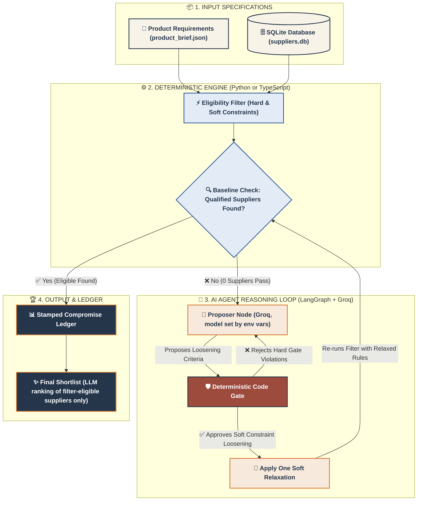

<p align="center">
  
</p>

<h1 align="center">SourceFix | AI Manufacturing Decision Copilot</h1>

<p align="center">
  <strong>Turn procurement briefs into citable supplier shortlists, with hard constraints enforced in code rather than by the LLM.</strong>
</p>

<p align="center">
  <a href="#-architecture-overview"></a>
  <a href="#-running-tests--verification"></a>
  <a href="#-models--configuration"></a>
  <a href="https://source-fix.vercel.app/"></a>
</p>

<p align="center">
  🚀 <strong><a href="https://source-fix.vercel.app/">Live Web App</a></strong> &nbsp;•&nbsp;
  🎥 <strong><a href="https://youtu.be/kdCmKI3OVuc">YouTube Video Demo</a></strong> &nbsp;•&nbsp;
  📊 <strong><a href="https://docs.google.com/presentation/d/1kDsACW6O3L37ypI7DrrTD72fo46XuLIM/edit?usp=sharing">Presentation Slide Deck</a></strong>
</p>

---

## ⚡ Executive Summary

**SourceFix** is an AI procurement decision copilot prototype for manufacturing leads evaluating custom hardware requirements (`product_brief.json`) against supplier data (`suppliers.db`). 

SourceFix puts **code guardrails around LLM reasoning**:
- **Deterministic Constraint Enforcement**: Hard constraints (certification, capacity, quality score) are evaluated by deterministic code, not by the LLM.
- **Code Gate Enforcement**: A code gate rejects any LLM proposal that targets a hard constraint. Only fields marked `soft` in the brief can be relaxed, one field per attempt.
- **Only two LLM steps**: Exactly two steps call an LLM: `propose_relaxation` (can loop) and finalize/ranking (runs once). Everything else is deterministic code, and only suppliers that pass the deterministic filter can appear in the shortlist.
- **Citation Audit**: A citation audit script (`demo_cases/verify_citations.py`) traced 10 of 10 numeric claims in the demo shortlist back to source rows (demo cases only, small synthetic dataset).

---

## 📐 System Architecture & Agent Flow

SourceFix uses a **LangGraph agent architecture** with Server-Sent Events (SSE) streaming state changes live to a Next.js workspace.


```mermaid
flowchart TB
    subgraph IN ["📦 1. INPUT SPECIFICATIONS"]
        direction TB
        A["📄 Product Requirements (product_brief.json)"]
        B[("🗄️ SQLite Database (suppliers.db)")]
    end

    subgraph ENGINE ["⚙️ 2. DETERMINISTIC ENGINE (Python or TypeScript)"]
        direction TB
        C["⚡ Eligibility Filter (Hard & Soft Constraints)"]
        D{"🔍 Baseline Check: Qualified Suppliers Found?"}
    end

    subgraph LLM ["🧠 3. AI AGENT REASONING LOOP (LangGraph + Groq)"]
        direction TB
        E["🤖 Proposer Node (Groq, model set by env vars)"]
        F["🛡️ Deterministic Code Gate"]
        G["🔄 Apply One Soft Relaxation"]
    end

    subgraph OUT ["🏆 4. OUTPUT & LEDGER"]
        direction TB
        H["📊 Stamped Compromise Ledger"]
        I["✨ Final Shortlist (LLM ranking of filter-eligible suppliers only)"]
    end

    A --> C
    B --> C
    C --> D
    
    D -->|"✅ Yes (Eligible Found)"| H
    D -->|"❌ No (0 Suppliers Pass)"| E
    
    E -->|"Proposes Loosening Criteria"| F
    F -->|"❌ Rejects Hard Gate Violations"| E
    F -->|"✅ Approves Soft Constraint Loosening"| G
    
    G -->|"Re-runs Filter with Relaxed Rules"| D
    H --> I

    %% Theme Styling
    classDef inputStyle fill:#f8f3e9,stroke:#25364b,stroke-width:2px,color:#25364b,font-weight:bold;
    classDef engineStyle fill:#e3ebf7,stroke:#315d9e,stroke-width:2px,color:#25364b,font-weight:bold;
    classDef llmStyle fill:#f7e9db,stroke:#d77931,stroke-width:2px,color:#25364b,font-weight:bold;
    classDef outputStyle fill:#25364b,stroke:#d77931,stroke-width:2px,color:#ffffff,font-weight:bold;
    classDef gateStyle fill:#9d4b3d,stroke:#25364b,stroke-width:2px,color:#ffffff,font-weight:bold;

    class A,B inputStyle;
    class C,D engineStyle;
    class E,G llmStyle;
    class F gateStyle;
    class H,I outputStyle;
```

### Two engines
The repo contains two implementations of the same agent loop:
- **Python backend**: FastAPI + LangGraph (`backend/app/agent/`), with SQLite supplier storage.
- **TypeScript engine**: `frontend/lib/agent-core.ts` (with `frontend/lib/backend-core.ts` as its deterministic core), running inside Next.js API routes.

The deployed Vercel app uses the **TypeScript engine** unless `SOURCEFIX_BACKEND_URL` is set, in which case the Next.js API routes proxy to the Python backend.

### LLM calls, fallbacks & logging
- **TypeScript engine**: when an LLM call fails (or returns an unusable reply), the engine uses a deterministic fallback computed only from the filter results and supplier data. It is labeled **"deterministic fallback, no LLM"** in the trace, the decision ledger and the finalist cards.
- **Python backend**: an unparseable proposal is retried once and then rejected (nothing is applied). An unparseable ranking falls back to the filter's own eligible order with no explanation, which the UI also labels as a deterministic fallback.
- **Logging**: every LLM call is logged with step, model, status and duration. The API key is never logged.

---

## 🎯 Key Features

| Feature | Description | Stack / Component |
| :--- | :--- | :--- |
| **5-Step Decision Workspace** | Requirements $\rightarrow$ Baseline $\rightarrow$ Agent Run $\rightarrow$ Shortlist $\rightarrow$ Decision Ledger. | Next.js 15, Tailwind CSS |
| **Persistent SQLite Database** | Real-time supplier data storage supporting dynamic CRUD operations without restarting servers. | SQLite3, FastAPI |
| **Supplier Management Admin** | Utilitarian back-office dashboard (`/admin`) to add, edit, and delete suppliers with instant baseline updates. | Next.js App Router (`/admin`) |
| **Live SSE Trace Terminal** | Terminal-style panel streaming agent reasoning nodes in real-time. | Server-Sent Events (SSE) |
| **Sensitivity Analysis** | Shows which single soft-constraint relaxation would rescue near-miss suppliers. Rendered in the Baseline step when the app is connected to the Python backend. The TypeScript engine's baseline route returns this data under a different key (`sensitivity_report`) that the UI does not currently render, so the panel does not appear on the default Vercel deployment. | Deterministic Engine |
| **Stamped Compromise Ledger** | Struck-through visual record of relaxed soft constraints with rationale and source (LLM proposal or deterministic fallback). | Visual Design System |

---

## 🤖 Models & Configuration

Models are set by environment variables:

| Variable | Read by | Purpose |
| :--- | :--- | :--- |
| `GROQ_API_KEY` | Python backend, TypeScript engine | Groq API key (required for agent runs; the baseline needs no key). |
| `GROQ_MODEL` | Python backend, TypeScript engine | Default model. The TypeScript engine uses it for both LLM steps (code default: `openai/gpt-oss-120b`). |
| `GROQ_PROPOSE_MODEL` | Python backend only | Model for `propose_relaxation`. Falls back to `GROQ_MODEL`, then to the code default `llama-3.3-70b-versatile`. |
| `GROQ_FINALIZE_MODEL` | Python backend only | Model for finalize/ranking. Falls back to `GROQ_MODEL`, then to the code default `llama-3.3-70b-versatile`. |
| `SOURCEFIX_BACKEND_URL` | Next.js API routes | If set, proxy to the Python backend instead of running the TypeScript engine. |

> ⚠️ The Python code default `llama-3.3-70b-versatile` returned **HTTP 404** on some Groq key tiers during testing, so set `GROQ_MODEL` (or the per-step variables) explicitly. The demo used `openai/gpt-oss-120b`.

---

## 📋 Prerequisites

- **Python**: 3.10+ (tested on Python 3.11)
- **Node.js**: 18+ (tested on Node 20 / 22)
- **Groq API Key**: Get a free API key from [console.groq.com](https://console.groq.com/keys).

---

## 🚀 Quickstart Guide

> 💡 **Windows Users Note:**
> - In `cmd.exe`, use `copy .env.example .env` instead of `cp`.
> - If PowerShell blocks script execution (`Activate.ps1`), run `Set-ExecutionPolicy -ExecutionPolicy RemoteSigned -Scope Process` or invoke Python directly (`.venv\Scripts\python.exe -m uvicorn app.main:app --host 127.0.0.1 --port 8000`).

### 1. Clone & Navigate
```bash
git clone https://github.com/AdeenaRamzan/Source-fix.git
cd Source-fix
```

### 2. Backend Setup & Startup
From the project root (`Source-fix/`):

```bash
# Navigate to backend
cd backend

# Create & activate virtual environment
python -m venv .venv
# On Windows PowerShell: .venv\Scripts\Activate.ps1
# On Linux/macOS: source .venv/bin/activate

# Install dependencies
pip install -r requirements.txt

# Create environment configuration
cp .env.example .env
```

Edit `backend/.env` and insert your Groq API key and models:
```env
GROQ_API_KEY=gsk_your_groq_api_key_here
GROQ_MODEL=openai/gpt-oss-120b
# Optional per-step overrides:
# GROQ_PROPOSE_MODEL=openai/gpt-oss-120b
# GROQ_FINALIZE_MODEL=openai/gpt-oss-120b
```

Start the FastAPI backend server on port 8000:
```bash
python -m uvicorn app.main:app --host 127.0.0.1 --port 8000
```
Backend health check: `http://localhost:8000/api/health`

### 3. Frontend Setup & Startup
Open a new terminal window and navigate to `frontend/`:

```bash
# From project root:
cd frontend
# (or 'cd ../frontend' if inside backend/)

# Install dependencies
npm install
```

Create `frontend/.env.local`:
```env
GROQ_API_KEY=gsk_your_groq_api_key_here
GROQ_MODEL=openai/gpt-oss-120b
# Optional: uncomment to use the Python backend instead of the built-in TypeScript engine
# SOURCEFIX_BACKEND_URL=http://localhost:8000
```

> Note: `frontend/.env.example` sets `SOURCEFIX_BACKEND_URL=http://localhost:8000`. If you copy it as-is, the frontend proxies to the Python backend.

Start the Next.js dev server:
```bash
npm run dev
```

Open your browser at **`http://localhost:3000`**

---

## 🛠️ Supplier Management Admin Panel

SourceFix includes a dedicated **Supplier Admin Dashboard** accessible at:
👉 **`http://localhost:3000/admin`**

- **Live Table**: View all suppliers stored in SQLite with real-time pass/fail cert badges.
- **Add / Edit Supplier**: Form supporting capacity, lead time, MOQ, region, quality score, sustainability score, and certification status.
- **Instant Synchronization**: Any supplier added or modified in the Admin panel immediately updates the Baseline and Agent Run steps on the main workspace.

---

## 🌐 Deploying to Vercel & Production

### 1. Deploying Frontend to Vercel
1. Import your GitHub repository (`https://github.com/AdeenaRamzan/Source-fix`) into [Vercel](https://vercel.com).
2. Vercel automatically detects Next.js configuration.
3. Configure Environment Variables in Project Settings:
   - `GROQ_API_KEY` *(Required)*: Your Groq API key for the TypeScript engine's LLM calls.
   - `GROQ_MODEL` *(Recommended, code default: `openai/gpt-oss-120b`)*: Model used by the TypeScript engine for both LLM steps.
   - `GROQ_PROPOSE_MODEL` *(Optional)*: Only read by the Python backend; the TypeScript engine currently ignores it.
   - `GROQ_FINALIZE_MODEL` *(Optional)*: Only read by the Python backend; the TypeScript engine currently ignores it.
   - `SOURCEFIX_BACKEND_URL` *(Optional)*: URL of a deployed FastAPI backend (e.g. `https://sourcefix-backend.onrender.com`). When omitted, Vercel runs the built-in TypeScript engine (`lib/agent-core.ts`).
4. Click **Deploy**.

### 2. Deploying FastAPI + SQLite Backend (Render / Railway / Fly.io)
Deploy the `backend/` directory to any Python service host (Render, Railway, Fly.io):
- **Build Command**: `pip install -r requirements.txt`
- **Start Command**: `python -m uvicorn app.main:app --host 0.0.0.0 --port $PORT`
- **Environment Variables**:
  - `GROQ_API_KEY`: Groq API key.
  - `GROQ_MODEL` *(Recommended; code default: `llama-3.3-70b-versatile`)*: Default model for both LLM steps.
  - `GROQ_PROPOSE_MODEL` *(Optional, falls back to `GROQ_MODEL`)*.
  - `GROQ_FINALIZE_MODEL` *(Optional, falls back to `GROQ_MODEL`)*.

---

## 🧪 Running Tests & Verification

### Pytest Test Suite (25 Tests)
The backend test suite contains **25 pytest tests**. None of them call a real LLM; LLM steps are replaced with fake callables:
- **`backend/tests/test_tools.py` (15 tests)**: Verifies deterministic constraint checks, expired/ambiguous certificate fail-closed handling, full-pack baseline filter, failure counting, exact citation lookup (`cite_lookup`), and sensitivity reports.
- **`backend/tests/test_agent.py` (6 tests)**: Verifies negotiation loop transitions, max-iteration termination, and code gate enforcement:
  - **Adversarial Hard-Constraint Test (`test_hard_constraint_is_never_relaxed_under_repeated_pressure`)**: Simulates a malicious LLM that repeatedly proposes relaxing all three hard constraints (`certification`, `monthly_capacity_units`, `quality_history_score`), cycling through them over 4 iterations with permissive values. Verifies that `apply_relaxation_node` rejects every proposal, logs each rejection in the ledger, keeps `working_constraints` identical to `original_constraints`, and exits with `status='no_shortlist_found'`.
- **`backend/tests/test_suppliers_crud.py` (4 tests)**: Verifies SQLite persistence, list/get/create/update/delete lifecycle, and 404/409 handling.

Run tests from `backend/`:
```bash
cd backend
python -m pytest tests/ -v
```

### TypeScript Gatekeeper Tests
The TypeScript engine has 2 small gate checks in `frontend/tests/agent-core.test.ts` (a hard constraint is identified as non-relaxable; a nonexistent field is rejected):
```bash
cd frontend
npx tsx tests/agent-core.test.ts
```

### Citation Verification Audit
From the project root (`Source-fix/`):
```bash
python demo_cases/verify_citations.py
```
This traces the numeric claims in the demo case shortlist back to source rows (10 of 10 in demo case 1). It covers the demo cases only, on a small synthetic dataset, and the demo cases were generated with deterministic stand-ins for the Groq calls (see `demo_cases/EXPLANATION.md`).

---

## 🧾 Demo data and limitations

- **The supplier dataset is synthetic.** It is hand-authored to exercise specific cases (see `backend/app/data/source_manifest.md`).
- **One supplier record was edited for the demo walkthrough.** In the original `backend/app/data/suppliers.json`, no supplier passes all constraints at baseline (SUP-009 has no `sustainability_score`). In `suppliers.db` and the TypeScript in-memory supplier store, SUP-009 has `sustainability_score = 60`, so with that data SUP-009 passes at baseline.
- **The LLM's choice of which soft constraint to relax can vary between runs**, even at temperature 0.
- **The agent relaxes one field per attempt.** It does not propose combined multi-field relaxations.
- **This is a hackathon prototype, not a production system.**

---

## 📁 Repository Structure

```
Source-fix/
├── README.md               # Visual quickstart & system architecture guide
├── SUBMISSION.md           # System architecture, evaluation analysis, & data dictionary
├── docs/                   # Documentation graphics & banner assets
├── backend/
│   ├── app/
│   │   ├── agent/          # LangGraph state graph, nodes, & deterministic tools
│   │   ├── data/           # SQLite database (suppliers.db), schema & JSON files
│   │   └── main.py         # FastAPI REST & SSE endpoints + CRUD API
│   ├── tests/              # Pytest suite (test_tools.py, test_agent.py, test_suppliers_crud.py)
│   ├── .env.example
│   └── requirements.txt
├── demo_cases/             # Generated evaluation case files & citation audit scripts
└── frontend/               # Next.js 15 + Tailwind CSS interactive workspace
    ├── app/
    │   ├── admin/          # Supplier CRUD Admin Dashboard (/admin)
    │   ├── api/            # Next.js API routes (TypeScript engine, or proxy to backend)
    │   ├── globals.css     # Paper/ink design system tokens
    │   └── page.tsx        # 5-Step decision workspace
    ├── lib/                # TypeScript engine (agent-core.ts), deterministic core, supplier store, types
    ├── tests/              # TypeScript gate checks (agent-core.test.ts)
    └── package.json
```

---

## 👥 Team

- **SGTDP Hackathon**, Track 1: Supplier Shortlisting (Top 25).
- **Team**: Adeena (lead), Rameen Ramzan, Hadia Khan.

---

## 📄 License & System Specifications

Built with paper/ink design aesthetics, deterministic code guardrails, and persistent SQLite storage.

